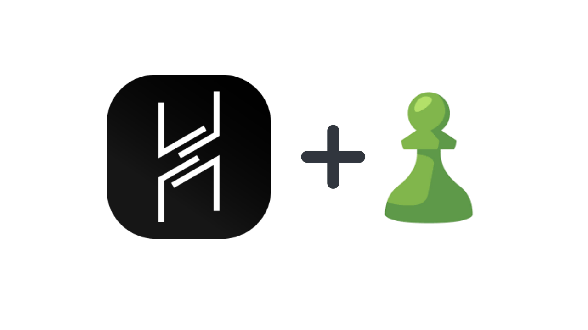

  

    
  

  <h1>CheckmateC2</h1>
   

  
<i>CheckmateC2 (Havoc) is a modern and malleable post-exploitation command and control framework, created by <a href="https://twitter.com/C5pider">@C5pider</a>.</i>

   

Will add some info here as I go...

but the idea is to use chess.com as a C2 channel for a custom implant and listener (everything else in Havoc will stay the same).

This is just a fun project - obiously.
